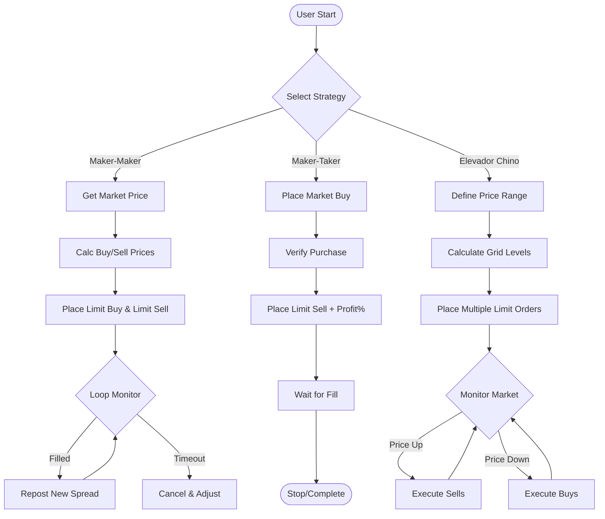

# Bitso Trading Bot - Logic Flowchart

```mermaid
flowchart TD
    Start([User Start]) --> ChooseStr{Select Strategy}
    
    %% Maker-Maker Logic
    ChooseStr -- Maker-Maker --> MM_GetPrice[Get Market Price]
    MM_GetPrice --> MM_Calc[Calc Buy/Sell Prices]
    MM_Calc --> MM_Place[Place Limit Buy & Limit Sell]
    MM_Place --> MM_Loop{Loop Monitor}
    MM_Loop -- Filled --> MM_Repost[Repost New Spread]
    MM_Loop -- Timeout --> MM_Cancel[Cancel & Adjust]
    
    %% Maker-Taker Logic
    ChooseStr -- Maker-Taker --> MT_Buy[Place Market Buy]
    MT_Buy --> MT_Verify[Verify Purchase]
    MT_Verify --> MT_Sell[Place Limit Sell + Profit%]
    MT_Sell --> MT_Wait[Wait for Fill]
    
    %% Elevador Chino Logic
    ChooseStr -- Elevador Chino --> EC_Range[Define Price Range]
    EC_Range --> EC_Grid[Calculate Grid Levels]
    EC_Grid --> EC_Distribute[Place Multiple Limit Orders]
    EC_Distribute --> EC_Monitor{Monitor Market}
    EC_Monitor -- Price Up --> EC_SellExec[Execute Sells]
    EC_Monitor -- Price Down --> EC_BuyExec[Execute Buys]
    
    %% Common End
    MM_Repost --> MM_Loop
    MT_Wait --> End([Stop/Complete])
    EC_SellExec --> EC_Monitor
    EC_BuyExec --> EC_Monitor
```
